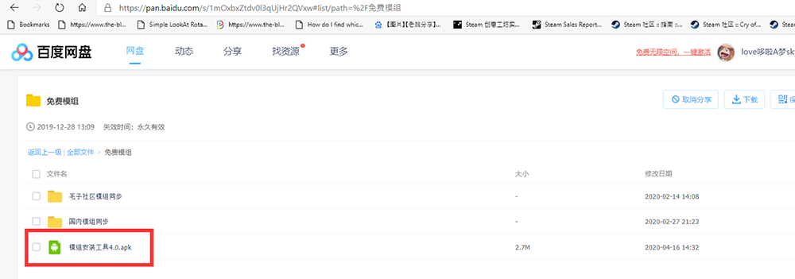
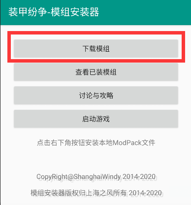
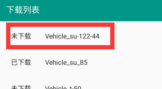
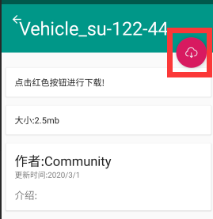
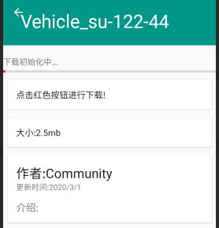
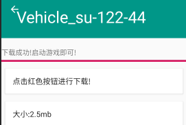
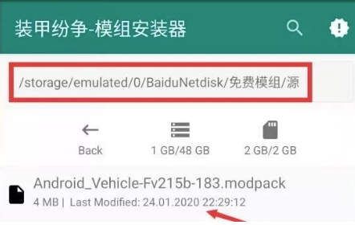

# 装甲纷争模组工坊

本模组教程适用于 Android（安卓）用户。iOS 玩家自带官方模组。Steam 玩家可通过创意工坊订阅。
写在最前面的温馨提示，如果对手机的文件夹完全不了解，不建议安装模组。可以考虑玩其他大厂游戏。

## 模组安装器

为安装便捷，请务必安装模组安装器进行安装。

下载地址: [点击下载](https://hub.waroftanks.cn/docs/app-release.apk)

## 法一:下载器内置下载

注:内置下载器采用境外的免费的 CDN 服务，所以下载速度可能比较感人。

安装教程:

1. 点击下载模组

   

2. 点击想要安装的模组 (若没出现列表，说明当前网络不佳，尝试刷新或使用百度云分流见法三)

   

3. 点击左上角的红色按钮

   

4. 等待下载完成！注意，此过程中不要离开此界面！

   

5. 出现如下提示，即下载完毕，进入游戏即可使用模组！

   

## 法二:官网站点分流

官网分流站 : <https://waroftanks.cn:4050/modHub>

1. 下载模组文件
2. 打开方式选择模组安装器

## 法三:百度云分流

为安装便捷，请务必安装模组安装器进行安装。

百度云分流站 : <https://pan.baidu.com/s/1mOxbxZtdv0l3qUjHr2QVxw>

安装教程:

1. 从百度云中下载模组文件(modpack)
2. 启动模组安装器，点击右下角的红色按钮。
3. 依次寻找文件夹 BaiduNetdisk , 免费模组 ,源
   如下图：

   

   点击其中的 modpack 后缀的文件

4. 启动游戏

## 你没看懂教程 🐎

啊，没事。

左转坦克世界:闪击战: <http://wotb.163.com/>

(为什么不推荐国际服?我觉得你连模组教程都看不懂，就别去国际服丢人了。)

## 最后

或者你可以试试 iOS 版本（自带官方模组）或者 Steam 版本（创意工坊一键订阅）。
